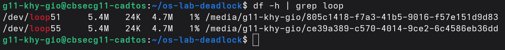
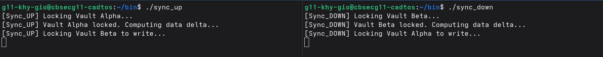
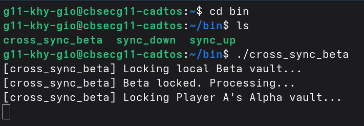
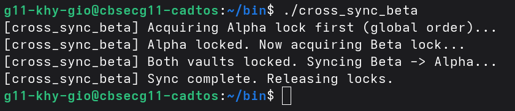
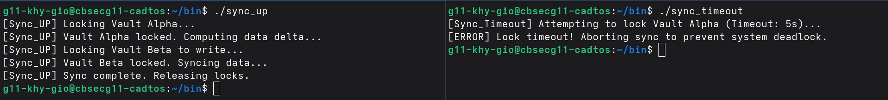

# os-lab-deadlock-IDTB110319

## Checkpoint 1 — Loop devices mounted

The output of `df -h | grep loop` confirms that both virtual disk images (`vault_alpha.img` and `vault_beta.img`) are attached as loopback devices (`/dev/loop55` and `/dev/loop51`) and successfully mounted with an accessible  ext4 file system, proving the virtual drives are live and ready for use.

## Checkpoint 2 — Deadlock observed

`sync_up` locked Vault Alpha then waited for Vault Beta. At the same time,
`sync_down` locked Vault Beta then waited for Vault Alpha. Each script held
exactly what the other needed, creating a circular wait — a classic deadlock.
Neither process could continue until manually killed with Ctrl+C.

## Checkpoint 3 — Cross-user deadlock

`cross_sync_beta` locked our local Beta vault then waited for Player A's
Alpha vault. Simultaneously, Player A's `cross_sync_alpha` locked their
Alpha vault then waited for our Beta vault. Both accounts froze in a
circular wait across two users — neither could proceed without the other
releasing first.

## Checkpoint 4 — Global resource ordering

Both scripts now acquire locks in the same strict order: Alpha first, Beta second.
This eliminates circular wait — one of the four necessary conditions for deadlock.
Whichever script wins the Alpha lock proceeds unblocked. The other waits at the
first step without holding anything, so no cycle can form.

## Checkpoint 5 — Deadlock recovery via timeout

`sync_timeout` uses `flock -w 5` to wait a maximum of 5 seconds for the
Alpha lock. If the lock is held by another process past that window, the
script aborts with a clear error instead of freezing.
